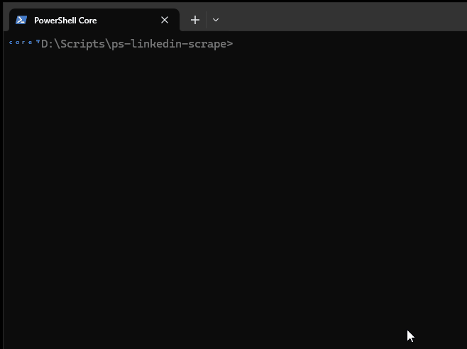

# LinkedIn Image Scraper using Selenium in PowerShell

This PowerShell script leverages the [Selenium PowerShell module](https://github.com/adamdriscoll/selenium-powershell) and [html-agility-pack](https://html-agility-pack.net/) to automate the scraping of image URLs from a LinkedIn company profile page. 

It scrolls through the user feed a configurable number of times or until a data size limit is reached, parses the feed content for image links, and downloads them locally.

## 📦 Features

- Automatically launches a web browser session using Selenium
- Logs in to the LinkedIn account
- Loads a LinkedIn company profile page (```https://www.linkedin.com/company/```**\<companyname\>**```/posts/?feedView=all"```)
- Scrolls the feed to load more content (configurable scroll count and/or maximum size streamed)
- Extracts image URLs from the loaded HTML content
- Downloads all images to a local directory
- Launches explorer in the images location window

---

## 🚀 Getting Started

### 📁 Prerequisites

- **PowerShell 5.1+** or **PowerShell Core (7+)**
- **.NET Framework 4.7.2+** (if using Windows PowerShell)
- **Google Chrome** installed (or another Selenium-supported browser)

### 🧰 Install Selenium Module

Install the Selenium PowerShell module from the PowerShell Gallery:

```powershell
Install-Module -Name Selenium -Scope CurrentUser -Force
```

> 🔗 PowerShell Gallery: [Selenium 3.0.1](https://www.powershellgallery.com/packages/Selenium/3.0.1)

You can verify installation with:

```powershell
Get-Module -ListAvailable Selenium
```

---

### 🧰 Install HtmlAgilityPack

1. Install the HtmlAgilityPack Dlls directly using the ```Install-HtmlAgilityPack.ps1``` script:
2. From the libs downloaded, select the one you want to use based on your powershell / system version


---

### 🧰 Register Credentials

1. Run the following:

```powershell
. ./Utils.ps1
Register-LinkedInCreds --Gui
```

2. Enter your credentials (they will be securely stored in the registry, encrypted using DAPI)

**FOR TESTING** You may want to set ```$TestOutput = $True``` in *Utils.ps1:139* to view the credentials in clear when you sent them.



---

## 🧠 Function Overview

### `Start-LinkedInScrapeTest`

This function automates the LinkedIn scraping process. Below is a breakdown of its logic:

#### 🔧 Parameters

- **None** directly defined in the current version. You may edit the script to pass a LinkedIn company URL and other settings via parameters for better reuse.

#### 🧪 Description

1. Launches a Selenium Chrome browser instance
2. Navigates to a LinkedIn company profile URL
3. Scrolls the page multiple times to load additional content
4. Extracts `` tag `src` attributes from the page content
5. Filters for media/image URLs
6. Downloads images to a local directory (`downloaded_images`)

#### 📂 Image URL Detection using HtmlAgilityPack

Images are detected by scanning the HTML for the a specific **XPATH** for items. 

```
/html/body/div[7]/div[3]/div/div[2]/div/div[2]/main/div[2]/div/div/div[2]/div[3]/div/div[1]/div[{0}]/div/div/div/div/div/div/div[1]/div[3]/div/div/button/div/div/img
                                                                                                 ^
                                                                                                 |
                                                                                             id will change for image index
```

#### Image URL Change Needed

We need to remove ```&amp``` from the image url so you can download it, else you get a unauthorized error.

```
  [string]$u = $ResultNode.Attributes[1].Value
  ### IMPORTANT: Remove this from the image url so you can download it, else you get a unauthorized error!
  [string]$value = $u.Replace('&amp;', '&')
```

---

## 📸 Output

- Downloads all matched image files into:
  ```
  ./downloaded_images
  ```
- Each image is saved with its original file name (based on the URL).

---

## 🔐 Notes and Considerations

- This script **will authenticate** into LinkedIn using a securely stored password (using DPAPI). See ```Register-AppCredentials``` and ```Get-AppCredentials``` functions. DPAPI uses keys that are generated and managed by Windows and is tied to the current user account (CurrentUser scope).
- As mentionned, it uses ```Register-AppCredentials``` and ```Get-AppCredentials```, part of another module I use. You may want to bypass those and use another way to store your username and password
- LinkedIn may enforce bot detection or rate-limiting. Use responsibly.
- Web scraping can be subject to a website's **terms of service**. Always comply with usage guidelines and legal requirements.
- If you want to use your own username, comment out the section using ```Get-AppCredentials``` and put in your credz

```
<307>        #########################################################################################
<308>        #
<309>        # Comment out the following lines if not using Get-AppCredentials
<310>        #
<311>        #########################################################################################
<312>        #$CredsCmd = Get-Command 'Get-AppCredentials' -ErrorAction Ignore
<313>        #if (!$CredsCmd) { throw "no Get-AppCredentials command (core mod)" }
<314>        #Write-Host "Get-AppCredentials for LinkedInWebPage..." -f Blue
<315>        #$Credz = Get-AppCredentials -Id "LinkedInWebPage"
<316>        #if (!$Credz) { throw "no LinkedInWebPage credentials registered, use Register-LinkedInCreds " }
<317>        #$LinkedInUsername = $Credz.UserName
<318>        #$LinkedInPassword = $Credz.GetNetworkCredential().Password
<319>        #########################################################################################
<320>        #########################################################################################
<321>        $LinkedInUsername = 'RogerRabbit1981'  <--- enter your username here
<322>        $LinkedInPassword = 'WolfKGary'        <--- enter your password here
<323>        #########################################################################################
<324>        #########################################################################################
```

---

## 🧪 Usage Example

Open PowerShell and run:

```powershell
. .\Test-LinkedInScrape.ps1
Start-LinkedInScrapeTest
```

You may need to modify the script to insert your target LinkedIn company page URL (look for the line in the script where the driver navigates to a page).

---

## 🛠️ Customization Ideas

- Download additional media types (videos, documents)

---

## 👨‍💻 Maintainer

Script by Guillaume Plante

---

## 📃 Demo

